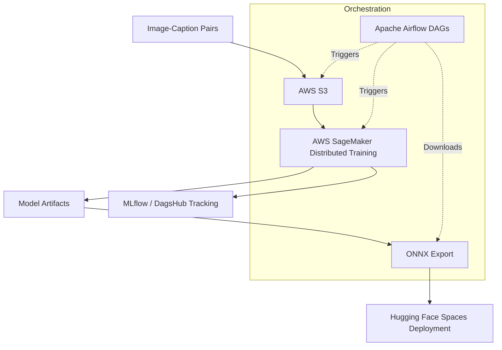

# System Design: Text-to-Image Generation (Diffusion Model)

## 1. Overview
This project implements a complete Latent Diffusion Model from scratch, trained in a distributed cloud environment. The architecture allows text-based image generation (text-to-image) using a combination of a Variational Autoencoder (VAE), a CLIP text encoder, and a denoising UNet with Cross-Attention.

## 2. Core Architecture

The architecture consists of the **Training Pipeline** (orchestrated in Airflow) and the **Inference Pipeline** (deployed on Hugging Face Spaces).

### Model Architecture (Latent Diffusion)
- **CLIP Text Encoder**: Converts the user's natural language prompt into a fixed-size embedding. This embedding acts as the conditioning signal for the UNet.
- **Variational Autoencoder (VAE)**: 
  - *Encoder*: Compresses high-resolution RGB images into a lower-dimensional latent space.
  - *Decoder*: Reconstructs the image from the denoised latent representation. This reduces the computational cost of training the UNet directly on pixel space.
- **Cross-Attentional UNet**: Predicts the noise added to the latent representation at a specific timestep `t`, conditioned on the CLIP text embeddings via cross-attention layers.

### Infrastructure & MLOps

1. **Apache Airflow**: Acts as the central orchestrator. It uploads data to S3, triggers SageMaker training jobs, monitors their status, and downloads the trained artifacts.
2. **AWS SageMaker + DeepSpeed**: Provides distributed multi-GPU training to accelerate the convergence of the diffusion model.
3. **MLflow on DagsHub**: Tracks training hyperparameters, VAE loss, Diffusion loss, and model checkpoints.

## 3. Design Choices & Trade-offs

* **Latent Space vs. Pixel Space**: Diffusion on raw pixels requires massive compute. By using a VAE to project images into a smaller latent space (e.g., $64 	imes 64$ from $256 	imes 256$), we drastically speed up training and inference while maintaining high visual fidelity.
* **DeepSpeed Distributed Training**: Selected over native PyTorch DDP due to its ZeRO optimization stages, which allow training large models by partitioning optimizer states and gradients across multiple GPUs.
* **Airflow for Orchestration**: Chosen to provide a robust, DAG-based workflow that can handle the complexities of cloud training (uploading to S3, waiting for SageMaker instances, downloading artifacts) cleanly and repeatedly.
* **ONNX Export**: By exporting the trained PyTorch model to ONNX, the inference server (Hugging Face Spaces) can run faster and lighter, avoiding PyTorch overhead for a pure deployment environment.

## 4. Deployment

The model is deployed as an interactive web application on **Hugging Face Spaces** using Streamlit. The deployment container:
1. Loads the ONNX-optimized UNet, VAE decoder, and CLIP encoder.
2. Accepts a text prompt from the user.
3. Generates pure noise in the latent space.
4. Iteratively denoises the latent representation using the UNet (conditioned on the text prompt).
5. Passes the final latent through the VAE decoder to render the generated image.
